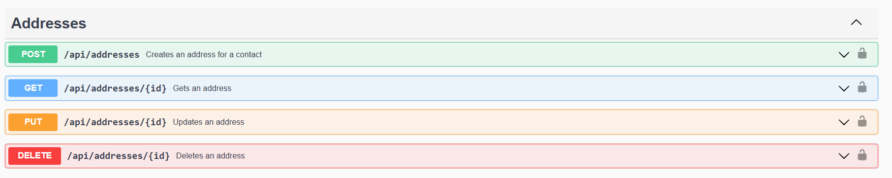

# Contact Hub Swagger UI URL

https://contacthubapicontainer.azurewebsites.net/swagger/index.html

# Contact Hub Entity Relationship Diagram

# User Endpoints

# Token Endpoints

# Confirmation Codes Endpoints

# Contact Endpoints

# Address Endpoints

# Authorization

Input `Bearer <token>` in order to access the endpoints that needs authorization.

The token can be retrieved from the `POST /api/tokens/acquire` endpoint.

